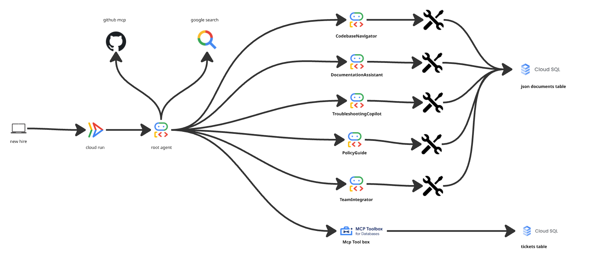
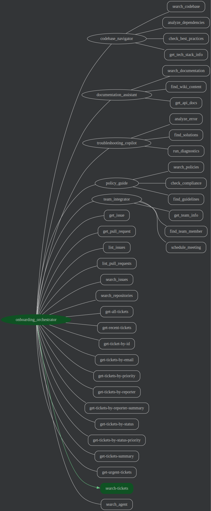

# NewHire Onboarding Assistant - Production ADK Multi-Agent System

A comprehensive, production-ready multi-agent system built with Google's Agent Development Kit (ADK) that accelerates new software engineer onboarding through specialized AI agents, real database integration, and external tool connectivity.


## 🏗️ Architecture



### **Production Infrastructure**
- **PostgreSQL Database**: Cloud SQL instance with structured JSON document storage
- **External Tool Integration**: ToolBox API for ticket management, GitHub MCP for repository operations
- **Multi-Agent Orchestration**: Intelligent routing with specialized domain experts
- **Real Data Sources**: Comprehensive company data including teams, policies, codebase info

### Root Agent: `onboarding_orchestrator`
Central coordinator that intelligently routes queries to specialized sub-agents and provides direct access to:
- **Ticket Management System**: Full CRUD operations for development tickets and issues
- **GitHub Integration**: Repository search, issue tracking, and code exploration
- **Google Search**: Web search capabilities for external information

### 5 Specialized Sub-Agents:

1. **🔍 CodebaseNavigator**
   - Code structure and architecture understanding
   - Dependency analysis
   - Best practices enforcement
   - Technology stack information

2. **📚 DocumentationAssistant**
   - Internal wiki access
   - API documentation retrieval
   - Tutorial recommendations
   - Knowledge base search

3. **🔧 TroubleshootingCopilot**
   - Error analysis and diagnosis
   - Solution recommendations
   - System diagnostics
   - Development environment issues

4. **📋 PolicyGuide**
   - HR policies and procedures
   - Security guidelines
   - Compliance requirements
   - Company standards

5. **👥 TeamIntegrator**
   - Team member information
   - Expertise matching
   - Meeting scheduling
   - Team culture insights

### **Integrated Tools & Capabilities**
- **ToolBox API**: 16 specialized tools for ticket management (read-only access)
- **GitHub MCP Tools**: Repository operations, issue tracking, pull request management
- **Google Search**: External information retrieval
- **Database Tools**: PostgreSQL integration for real company data

## 🚀 Quick Start

### Prerequisites
- Python 3.11+
- Google Cloud Project with billing enabled
- ADK authentication configured (Vertex AI or Google AI Studio)
- PostgreSQL database (Cloud SQL instance configured)
- ToolBox API access (for ticket management)
- GitHub Personal Access Token (for repository operations)

### Installation

1. **Clone the repository**
```bash
git clone <repository-url>
cd newhire-onboarding-adk
```

2. **Set up PostgreSQL Database**
```bash
# Connect to your Cloud SQL instance and run the setup script
psql -h host -U postgres -d postgres < onboard.sql
# This creates the onboard_data database with complete sample data
```

3. **Create virtual environment**
```bash
python -m venv .venv
source .venv/bin/activate  # On Windows: .venv\Scripts\activate
```

4. **Install dependencies**
```bash
pip install -r requirements.txt
```

5. **Configure environment**
```bash
# Edit .env with your credentials (sample .env included):
# Google Cloud Configuration:
GOOGLE_GENAI_USE_VERTEXAI=true
GOOGLE_CLOUD_PROJECT=your-project-id
GOOGLE_CLOUD_LOCATION=us-central1

# Database Configuration (Cloud SQL):
DB_HOST=host
DB_PORT=5432
DB_NAME=your_databasename
DB_USER=your_username
DB_PASSWORD=your_password
DB_SSLMODE=require

# External Service Configuration:
URL=https://toolbox-api-url  # ToolBox API endpoint
GITHUB_PERSONAL_ACCESS_TOKEN=your_github_token
```

### Running the Assistant

**Local Development (CLI)**
```bash
adk run .
```

**Web Interface**
```bash
adk web
# Open http://localhost:8000
```

## 🎯 Example Queries

### Toolbox ticket table
- "Show me all open tickets"
- "Show me all critical priority tickets"
- "What tickets has Bob Johnson reported?"
- "Give me ticket statistics and summary"

### Git mcp
- "Find all repositories created by Mahesh5h9"
- "get issues of Mahesh5h9/leetcode-problems repo"

Try these example queries to see the multi-agent system in action:

### Codebase Questions
- "How does user authentication work in our system?"
- "What are the dependencies for the payment gateway?"
- "Show me the best practices for Python development standards?"

### Documentation
- "Where can I find the API documentation for payments?"
- "Show me tutorials on our authentication system"
- "Find wiki pages about deployment process of pipelines"

### Troubleshooting
- "I'm getting a database connection refused error"
- "ModuleNotFoundError when importing auth module"
- "How do I fix JWT token expired errors?"

### Policy & Compliance
- "What's the PTO policy?"
- "What are the security requirements for handling customer data?"
- "Show me password security guidelines"

### Team Integration
- "Who should I talk to about authentication issues?"
- "Find team members with Python expertise"
- "Show me the Backend Authentication Team structure"
- "Find someone who knows about Docker"


## 📁 Project Structure

```
changed_new_hire/
├── __init__.py                    # Package initialization (ADK pattern)
├── agent.py                       # Main multi-agent definitions
├── .env                          # Environment configuration
├── requirements.txt              # Python dependencies
├── README.md                     # This documentation
├── onboard.sql                   # Complete database schema & sample data
├── tools.yaml                    # ToolBox configuration for ticket tools
├── newhire-onboarding-key.json  # Service account credentials
│
├── tools/                        # Specialized agent tools
│   ├── __init__.py              # Tool exports
│   ├── external_tools.py        # ToolBox, GitHub, Search integrations
│   ├── codebase_tools.py        # Code repository analysis
│   ├── documentation_tools.py   # Wiki and API documentation
│   ├── troubleshooting_tools.py # Error diagnosis and solutions
│   ├── policy_tools.py          # HR policies and compliance
│   └── team_tools.py            # Team structure and member info
│
└── database/                    # Database integration layer
    ├── __init__.py
    └── db_loader.py             # PostgreSQL JSON document loader
```

## 🧪 Testing

### Test Database Connection
```bash
# Test PostgreSQL connection and data loading
python -c "from new_hire.database.db_loader import DatabaseLoader; loader = DatabaseLoader(); print('Database connection:', 'SUCCESS' if loader.load_data('teams/team_members.json') else 'FAILED')"
```

### Test Tool Integration
```bash
# Test ToolBox API connection
python -c "from new_hire.tools.external_tools import toolbox_tools; print('ToolBox tools loaded:', len(toolbox_tools))"

# Test individual agent capabilities
adk run . --test-mode
```

## 🚢 Deployment

### Local Testing
```bash
adk run .
```


### Environment Variables

| Variable | Description | Required | Example |
|----------|-------------|----------|----------|
| `GOOGLE_GENAI_USE_VERTEXAI` | Use Vertex AI (true) or Google AI Studio (false) | Yes | `true` |
| `GOOGLE_CLOUD_PROJECT` | GCP project ID (if using Vertex AI) | Conditional | `your project name` |
| `GOOGLE_CLOUD_LOCATION` | GCP region for Vertex AI | Conditional | `us-central1` |
| `GOOGLE_API_KEY` | API key (if using Google AI Studio) | Conditional | `API key` |
| `DB_HOST` | PostgreSQL Cloud SQL instance IP | Yes | `Host` |
| `DB_PORT` | PostgreSQL database port | Yes | `5432` |
| `DB_NAME` | PostgreSQL database name | Yes | `onboard_data` |
| `DB_USER` | PostgreSQL database user | Yes | `postgres` |
| `DB_PASSWORD` | PostgreSQL database password | Yes | `your_password` |
| `DB_SSLMODE` | SSL mode for database connection | Yes | `require` |
| `URL` | ToolBox API endpoint URL | Yes | `https://toolbox-api-url` |
| `GITHUB_PERSONAL_ACCESS_TOKEN` | GitHub API access token | Yes | `github_pat_...` |
| `LOG_LEVEL` | Logging level (INFO, DEBUG, ERROR) | No | `INFO` |

## 🔒 Security Considerations

- **Database Security**: Uses Cloud SQL with SSL connections and IAM authentication
- **API Security**: GitHub tokens and ToolBox API keys stored securely in environment variables
- **Credential Management**: Service account keys and tokens never committed to version control
- **Network Security**: All external connections use HTTPS/TLS encryption
- **Data Privacy**: Sample data included, replace with real company data following privacy guidelines
- **Access Control**: ToolBox tools configured with read-only access for security

## 🤝 Contributing

1. Fork the repository
2. Create a feature branch
3. Make your changes
4. Add tests for new functionality
5. Submit a pull request


## 🆘 Support

For issues or questions:
- Check the [ADK documentation](https://google.github.io/adk-docs/)
- Review example queries above
- Contact the team through internal channels

## 🚀 Advanced Features

### **Database-Driven Architecture**
- **PostgreSQL Integration**: Cloud SQL instance with JSON document storage
- **Scalable Data Model**: Structured categories for teams, codebase, documentation, policies, troubleshooting
- **Real-time Data**: Live database queries replace static file-based data

### **External Tool Ecosystem**
- **ToolBox Integration**: 16 specialized ticket management tools with read-only security
- **GitHub MCP Protocol**: Repository search, issue tracking, PR management through Model Context Protocol
- **Google Search Integration**: Web search capabilities for external information retrieval

### **Production-Ready Deployment**
- **Cloud Run Compatible**: Easy containerized deployment with environment variables
- **Vertex AI Ready**: Native integration with Google Cloud's managed AI platform
- **Monitoring & Logging**: Structured logging with configurable levels
- **Security Best Practices**: SSL database connections, secure credential management

## 🎉 Acknowledgments

Built with Google's Agent Development Kit (ADK) following production best practices from:
- [ADK Official Documentation](https://google.github.io/adk-docs/)
- [ADK Sample Projects](https://github.com/google/adk-samples)
- [ADK Renovation Agent Pattern](https://github.com/AbiramiSukumaran/adk-renovation-agent)
- [ToolBox Core Integration](https://github.com/toolbox-team/toolbox-core)
- Internal engineering and ADK community best practices

## 📋 Implementation Notes

### **Database Schema**
- **json_documents table**: Stores all application data as categorized JSON documents
- **Comprehensive sample data**: 5 categories with realistic company information
- **Scalable design**: Easy to extend with new data categories and document types

### **Tool Architecture**
- **Modular design**: Each agent has specialized tools for its domain
- **External integrations**: ToolBox for tickets, GitHub for repositories, Google for search
- **Security model**: Read-only access to external systems, secure credential management

### **Agent Orchestration**
- **Intelligent routing**: Root agent uses LLM reasoning to route to appropriate specialists
- **Sub-agent expertise**: Each agent has detailed domain knowledge and specialized tools
- **Comprehensive coverage**: Handles technical, policy, team, and troubleshooting queries

---

**Production Note**: This system uses a live PostgreSQL Cloud SQL database and real API integrations. The `onboard.sql` file contains complete schema and comprehensive sample data. For production deployment, replace sample data with actual company information while maintaining the same JSON document structure.
